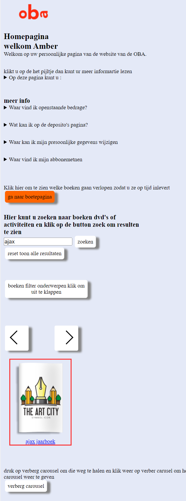
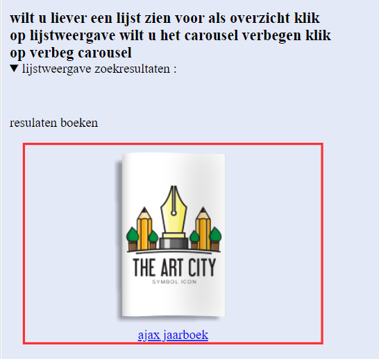
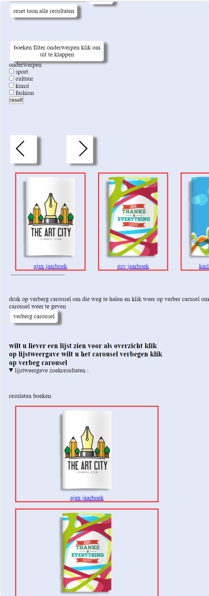

> _Fork_ deze leertaak en ga aan de slag. Onderstaande outline ga je gedurende deze taak in jouw eigen GitHub omgeving uitwerken. De instructie vind je in: [docs/INSTRUCTIONS.md](https://github.com/fdnd-task/all-human-accessible-website/blob/main/docs/INSTRUCTIONS.md)

# Accessible Website voor de oba
Ik ga voor de oba verder met de welkompagina waarin ik ook ga kijken hoe ik deze website zo toegankelijkmogelijk kan krijgen
Ontwerp en maak voor een opdrachtgever een component/pagina/site toegankelijk volgens WCAG richtlijnen.

## Inhoudsopgave

  * [Beschrijving](#beschrijving)
  * [Kenmerken](#kenmerken)
  * [Bronnen](#bronnen)
  * [Licentie](#licentie)

## Beschrijving
<!-- In de Beschrijving staat hoe je project er uit ziet, hoe het werkt en wat je er mee kan. -->
<h3>voor mobiel</h3>
<br>


<hr>
verder is er ook een reset button om alle resultaten te laten zien
<br>

<hr>
<h3>voor tablet</h3>
<br>

<br>

<hr>
<h3>voor laptop en deskstop</h3>
het verschil dat de caorusel breder is en dat de lijstweergave 3 koloms zijn 

<!-- Voeg een mooie poster visual toe 📸 -->
<!-- Voeg een link toe naar Github Pages 🌐-->

## Kenmerken
<!-- Bij Kenmerken staat welke technieken zijn gebruikt en hoe. Wat is de HTML structuur? Wat zijn de belangrijkste dingen in CSS? Wat is er met Javascript gedaan en hoe? Misschien heb je een framwork of library gebruikt? -->
in de html heb ik gekozen voor grid

```
.grid-container {
display: grid; /*1 grote container met daarin 4 kinderen*/
/*grid-gap: 1em;*/
grid-template-areas:
"item1 "/*regel1*/
"item2"
"item3"
"item4"
"item5"
"item6"
"item7"
/*"item6"!*regel2*!*/;
grid-template-columns: 1fr;
}
```

voor tablet en desktop heb ik dit
```
.grid-container {
grid-template-areas:
"item1 item3"
"item2 item3"
"item4 item3"
"item5 item6"
"item7 item7";

        /*grid-template-columns: 1fr 1fr;*/
        gap: 2em;

        grid-template-columns: repeat(2, minmax(0, 10fr));

        /*background-color: red;*/

    }
```
<h3>javascript code</h3>
hier heb ik voor het zoeken deze code gemaakt zodat er gezocht kan worden naar het boek op titel 
````
function searchfunction() {
let input, filter, ul, li = [], booktitle, txtValue;
input = document.getElementById("searchfunciton");
filter = input.value.toUpperCase();
ul = document.getElementsByClassName("myUL");
    for (let i = 0; i < ul.length; i++) {
        let all_ul = ul[i];/*verzamleing door de 2 ul */
        let alle_li = all_ul.getElementsByTagName("li");/*alle li itemsn*/

        for (let j = 0; j < alle_li.length; j++) {/*loop door de li items*/
            booktitle = alle_li[j].getElementsByClassName("booktitle")[0];/*haal eerste element op van de li items*/
            txtValue = booktitle.textContent || booktitle.innerText;/*txt is de */
            if (txtValue.toUpperCase().indexOf(filter) > -1) {
                alle_li[j].style.display = "";
            } else {
                alle_li[j].style.display = "none";
            }
            li.push(alle_li[j]); // Voeg het li-element toe aan de li-array
        }
    }

    let rest = document.querySelector('.reset');

    rest.addEventListener('click', function () {
        // Selecteer alle li-elementen
        for (let i = 0; i < li.length; i++) {
            li[i].style.display = "block"; //laat de resultaten weer zien
        }
    });
}
````

## installatie
je kan op de groen knop code klikken en dan de code downloaden ook staat er rechtsboven meestal fork

een fork als deze 


## Bronnen

## Licentie


This project is licensed under the terms of the [MIT license](./LICENSE).
