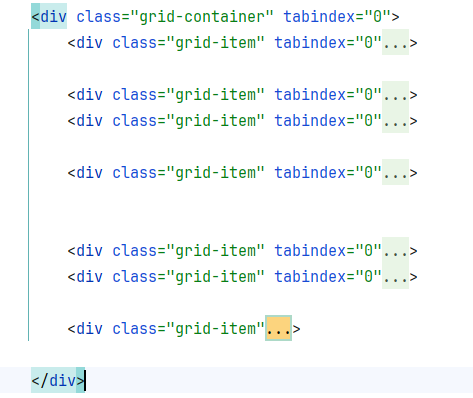

> _Fork_ deze leertaak en ga aan de slag. Onderstaande outline ga je gedurende deze taak in jouw eigen GitHub omgeving uitwerken. De instructie vind je in: [docs/INSTRUCTIONS.md](https://github.com/fdnd-task/all-human-accessible-website/blob/main/docs/INSTRUCTIONS.md)

# Accessible Website voor de oba
Ik ga voor de oba verder met de welkompagina waarin ik ook ga kijken hoe ik deze website zo toegankelijkmogelijk kan krijgen
Ontwerp en maak voor een opdrachtgever een component/pagina/site toegankelijk volgens WCAG richtlijnen.

## Inhoudsopgave

  * [Beschrijving](#beschrijving)
  * [Kenmerken](#kenmerken)
  * [Bronnen](#bronnen)
  * [Licentie](#licentie)

## Beschrijving
<!-- In de Beschrijving staat hoe je project er uit ziet, hoe het werkt en wat je er mee kan. -->
voor mobiel
 

2
 
voor tablet

<!-- Voeg een mooie poster visual toe 📸 -->
<!-- Voeg een link toe naar Github Pages 🌐-->

## Kenmerken
<!-- Bij Kenmerken staat welke technieken zijn gebruikt en hoe. Wat is de HTML structuur? Wat zijn de belangrijkste dingen in CSS? Wat is er met Javascript gedaan en hoe? Misschien heb je een framwork of library gebruikt? -->
in de html heb ik gekozen voor grid

## installatie
je kan op de groen knop code klikken en dan de code downloaden

## Bronnen

## Licentie

This project is licensed under the terms of the [MIT license](./LICENSE).
